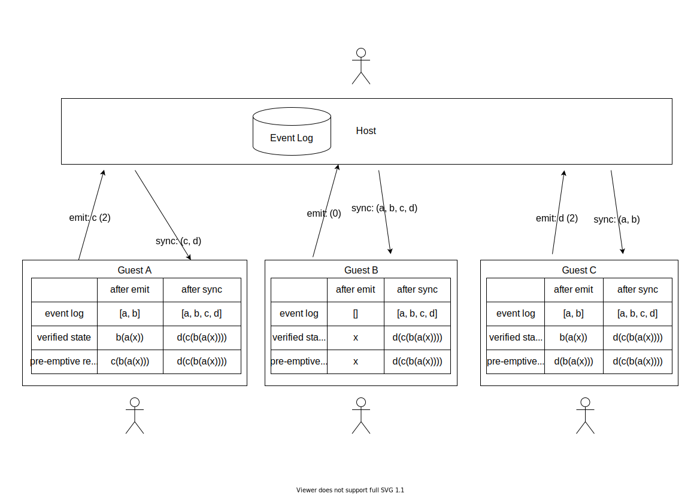

# Peer Party

> React hooks for connecting guests to a host via WebRTC.

### @compendium/peer-party

Peer Party uses WebRTC and a common set of game rules to host and share a multiplayer game with freinds, all without the use of a server. Guest can emit valid game moves to the host and the host will broadcast what moves have been made by whom.

[](https://www.npmjs.com/package/@compendium/peer-party) [](https://standardjs.com)

## Install

```bash
npm install --save @compendium/peer-party
```

## Usage

```tsx
import React from 'react'
import { usePartyGuest, usePartyHost } from '@compendium/peer-party'

const MyGamesRules = {
  guestMoves: {
    makeGuestMove: ({ state }) => ({ ...state, title: "Guest's are better" })
  },
  hostMoves: {
    makeHostMove: ({ state }) => ({ ...state, title: "Host is best" })
  }
}

const GuestComponent = ({ roomId }) => {
  const { state, moves } = usePartyGuest({ roomId, game: MyGamesRules });
  return (
    <div>
      <h1>{state.title}</h1>
      <button onClick={() => moves.makeGuestMove()}>
        Click Me
      </button>
    </div>
  );
}

const HostComponent = ({ roomId }) => {
  const { state, moves } = usePartyHost({ roomId, game: MyGame });
  return (
    <div>
      <h1>{state.title}</h1>
      <button onClick={() => moves.makeHostMove()}>
        Click Me
      </button>
    </div>
  );
}
```

## Architecture and Design

 All guests using the list of events generate their own local state by applying the deterministic move functions to a state. This prevents the host having to send large amounts of data to guests over the network, whilst maintaining a reactive experience and allowing guests to preempt the game state after making their move locally.



Randomness is handled using seeded random number generators.

Secret states are handled on the host, which sends a patch (diffs) to each guest, which they apply to their local state.

## License

UNLICENSED © [James O'Toole](https://github.com/SmileyJames)
